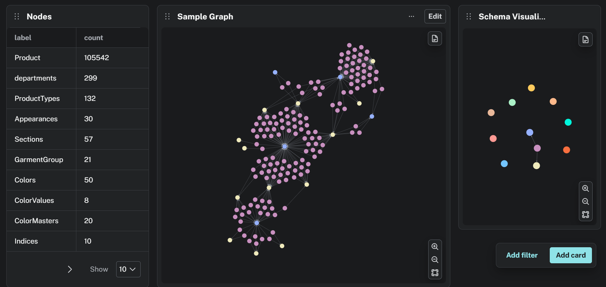

# 👗 AI Personal Stylist

An end-to-end **Generative AI Personal Stylist** that provides personalized outfit recommendations by combining **Azure SQL**, **Neo4j**, **Azure AI Search**, **LlamaIndex**, and **Google Gemini**.

The application leverages a **Hybrid Retrieval-Augmented Generation (RAG)** architecture to deliver context-aware, explainable, and personalized fashion recommendations based on user preferences, body type, skin tone, occasion, weather, and product relationships.

---

# 🚀 Features

* 🤖 AI-powered outfit recommendations
* 💬 Multi-turn conversational chatbot
* 👤 Personalized user profiles
* 👗 Occasion-based outfit suggestions
* ☀️ Weather-aware recommendations
* 🎨 Skin tone and color matching
* 📐 Body shape recommendations
* 🔍 Hybrid semantic + structured search
* 🧠 Graph-based outfit matching
* 📝 Explainable recommendations
* 📊 Langfuse observability
* ⚡ FastAPI REST APIs

---

# 🏗️ Architecture

```text
                                     User
                                       │
                                       ▼
                               FastAPI Backend
                                       │
                                       ▼
                        LangGraph Agent / Orchestrator
                                       │
             ┌─────────────────────────┴────────────────────────┐
             ▼                                                  ▼
     Conversation Memory                              Entity Extraction
             │                                                  │
             └─────────────────────────┬────────────────────────┘
                                       ▼
                           LlamaIndex Query Engine
                                       │
          ┌───────────────┬────────────┴────────────┬───────────────┐
          ▼               ▼                         ▼               ▼
   Azure SQL       Azure AI Search           Neo4j Graph       External APIs
 (Metadata)      (Vector Retrieval)       (GraphRAG)      (Weather, Trends)
          │               │                         │               │
          └───────────────┴────────────┬────────────┴───────────────┘
                                       ▼
                           Hybrid Context Fusion
                                       │
                                       ▼
                          Cross-Encoder Reranker
                                       │
                                       ▼
                     Prompt Builder + Grounding Layer
                                       │
                                       ▼
                             Gemini 2.5 Flash
                                       │
                                       ▼
                        Structured AI Recommendation
                                       │
              ┌────────────────────────┴─────────────────────────┐
              ▼                                                  ▼
        Langfuse Tracing                              RAG Evaluation
    (Latency • Tokens • Cost)             (Faithfulness • Recall • Precision)
```

# 🏗️ User Prompt Workflow

```
                            User
                              │
                              ▼
                       FastAPI Backend
                              │
                ┌─────────────┴─────────────┐
                ▼                           ▼
      User Profile Store          Conversation Memory
 (Body Shape • Skin Tone •        (Chat History)
  Size • Budget • Preferences)
                └─────────────┬─────────────┘
                              ▼
                     Retrieval Pipeline
```

# 🏗️ Graph RAG & Entity Extraction Setup

```
Clean Dataset
        │
        ▼
Normalize SQL Database
        │
        ▼
Create SQL Foreign Keys
        │
        ▼
Design Graph Schema
        │
        ▼
Create Neo4j Constraints
        │
        ▼
Import Nodes (UNWIND + MERGE)
        │
        ▼
Verify Labels
        │
        ▼
Import Relationships
        │
        ▼
Verify Relationship Counts
        │
        ▼
Visualize Graph
        │
        ▼
Build GraphRAG Retriever
```
---
## 📊 Neo4j Dashboard



---

## 🎥 Neo4j Graph Demo

Watch the graph traversal here:

[▶️ Neo4j Graph Demo](readme_content/neo4jGraph.mp4)

---

# 🛠️ Tech Stack

## Backend

* Python
* FastAPI

## AI / LLM

* Google Gemini
* LlamaIndex
* RAG

## Databases

* Azure SQL Database
* Neo4j

## Search

* Azure AI Search
* Vector Search
* Semantic Search
* Hybrid Search

## AI Components

* Embeddings
* HNSW
* Cross Encoder Reranking
* Context Fusion

## Monitoring

* Langfuse

---

# 🕸️ Neo4j Graph

Example relationships:

* `MATCHES_WITH`
* `SIMILAR_TO`
* `SUITABLE_FOR`
* `BELONGS_TO`
* `HAS_COLOR`
* `OCCASION`
* `STYLE`

---

# 🔄 AI Retrieval Pipeline

1. User submits a query.
2. FastAPI receives the request.
3. LlamaIndex routes the query.
4. Azure SQL performs structured filtering.
5. Azure AI Search performs semantic retrieval.
6. Neo4j expands product relationships.
7. Context Fusion merges retrieved information.
8. Cross-Encoder reranks the retrieved context.
9. Gemini generates the final recommendation.

---

# 👗 User Preference Form

* Body Shape
* Skin Tone
* Favorite Colors
* Style Preference
* Occasion
* Weather
* Season
* Budget
* Conversation History
* Purchase History

---

# ⚙️ Installation

Creating Neo4j Nodes and Relationships
```bash
python -m venv graph.run_imports
```
IMPORT_NODES = False
IMPORT_RELATIONSHIPS = True

Set variables according to what you are trying to achieve

Create a virtual environment.

```bash
python -m venv chatbot-env
```

Activate the environment.

### Windows

```bash
chatbot-env\Scripts\activate
```

### Linux / macOS

```bash
source chatbot-env/bin/activate
```

Install dependencies.

```bash
pip install -r requirements.txt
```

Run the application.

```bash
uvicorn app.main:app --reload
```


